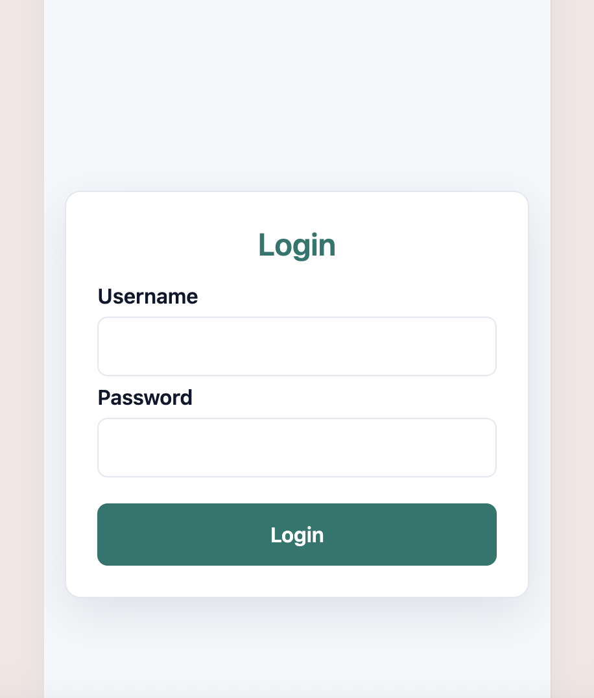
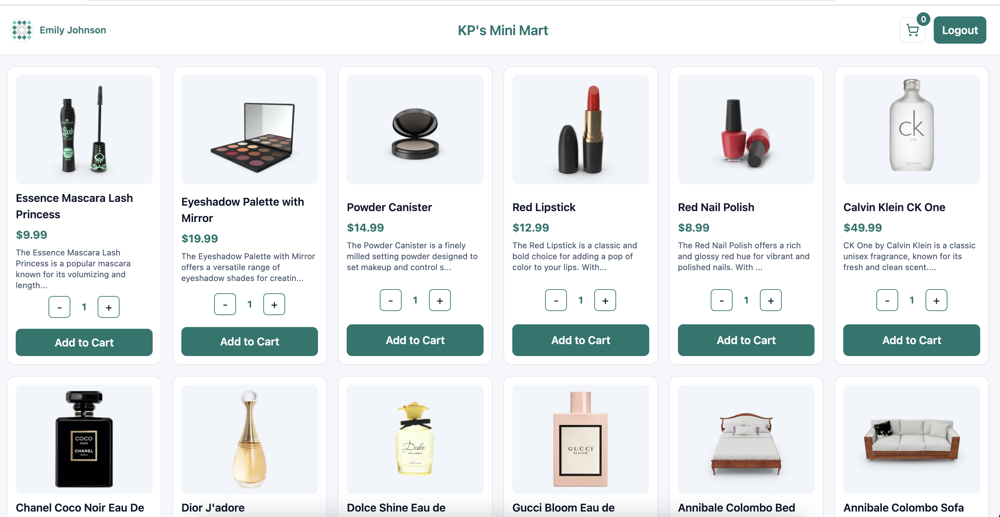
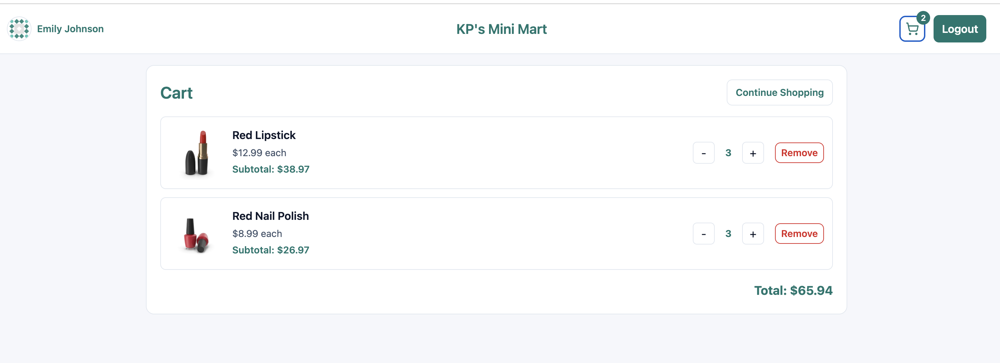
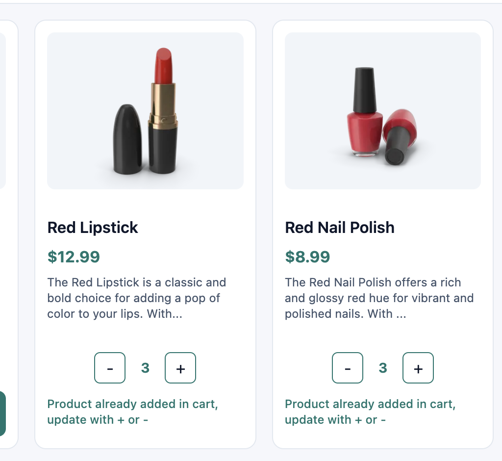

# KP Mart

A clean and simple e-commerce frontend built with React, TypeScript, and Redux Toolkit.

## Setup

### 1) Install dependencies
```bash
npm install
```

### 2) Run in development
```bash
npm run dev
```
Open the local URL shown in terminal (usually `http://localhost:5173`).

### 3) Build for production
```bash
npm run build
```

### 4) Preview production build
```bash
npm run preview
```

### 5) Lint
```bash
npm run lint
```

---

## State Management (Simple)

This project uses **Redux Toolkit** for global state.

### What is stored?

- **Auth state (`auth`)**
  - `token`
  - `user`
  - `isAuthenticated`

- **Cart state (`cart`)**
  - list of cart items
  - quantity updates (increase/decrease)
  - remove and clear actions
  - stock-safe quantity handling

### How it works

1. App starts and reads saved data from `localStorage`
2. Store is hydrated using:
   - `hydrateAuth(...)`
   - `hydrateCart(...)`
3. Every store update is saved back to `localStorage`

This keeps login/cart data after page refresh.

### Typed Redux hooks

- `useAppDispatch` for dispatch
- `useAppSelector` for selecting state

---

## Important Files

- `src/main.tsx` - app bootstrap (`Provider`, router, toast container)
- `src/store/index.ts` - store setup + hydration + persistence subscription
- `src/store/auth-slice.ts` - auth reducer and actions
- `src/store/cart-slice.ts` - cart reducer and actions
- `src/store/storage.ts` - localStorage read/write helpers
- `src/store/hooks.ts` - typed Redux hooks

---

## Scripts

- `npm run dev` - start dev server
- `npm run build` - type-check and build
- `npm run preview` - preview build locally
- `npm run lint` - run ESLint

Default demo credentials:

- Username: `emilys`
- Password: `emilyspass`

---

## Screenshots

### Login


### Products


### Cart


### After Add to Cart


